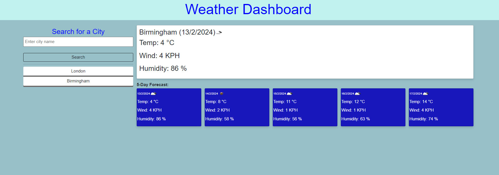

# Weather-Dashboard

## Description
- Create a weather dashboard for people see the today weather and 5-days forcast weather.

## Table of Contents
- [Website Preview](#website-preview)
- [Features](#features)
- [Technologies Used](#echnologies-used)
- [Project Requirements](#project-requirements)
- [Usage](#usage)
- [License](#license)

## Features
- **Check the city's current weather and showing the history.
- Showing 5 days forcast and current weather
- **User-Friendly Dashboard:** Simple and works in your browser.
- **Responsive Design**: Your data stays on your device, ensuring your privacy and security.

## Technologies Used
- HTML5
- CSS3
- Bootstrap
- JavaScript
- Weather API with fetch 

## Project Requirements
To ensure a dynamic and responsive user experience for checking weather:
- Bootstrap for responsive design and components.
- jQuery and fetch for dynamic content loading and API interactions.
- openweather API for searching the city's weather 
- JavaScript essentials like loops, conditionals, event listeners, and client-side storage for a seamless and interactive experience.
- Mobile responsiveness to ensure accessibility on all devices.

## Usage
- Website Preview
![ Website Preview]
https://vickyw0102.github.io/Weather-Dashboard/ 

Here's a look at the web application:

## Credits

Very graceful to have below teammate and TA for working the codes together;

## License
Distributed under the MIT License. See LICENSE for more information.

